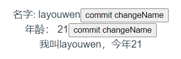
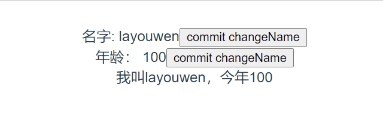

# 简单实现 Vuex 了解其实现原理

## 1、前言

本篇文章循序渐进带大家实现 Vuex 的主要功能，阅读前需要对 vue 的使用有基本的认识，学习过 class 了解其基本概念。

下面我们就开始吧

## 2、准备测试数据

我们可以使用 VueCli 搭建一个 Vuex 的项目。这里简单的说一下命令

```bash
# 如果你使用 yarn
yarn global add @vue/cll
# 如果你使用 npm
npm install -g @vue/cli
# 创建 Vue2 项目
vue create vue-study
```

安装完后，直接启动该服务

```bash
cd vue-study
yarn serve
```

接着我们可以先使用官方的 **Vuex** 先跑一个测试例子

```bash
yarn add vuex
```

编写文件 store/index.js

```js
import Vue from 'vue'
import Vuex from 'vuex'

Vue.use(Vuex)

export default new Vuex.Store({
  state: {
    name: 'layouwen',
    age: 100,
  },
  mutations: {
    changeName(state, newName) {
      state.name = newName
    },
    changeAge(state, newAge) {
      state.age = newAge
    },
  },
  actions: {
    changeAge(store, newAge) {
      setTimeout(() => {
        store.commit('changeAge', newAge)
      }, 2000)
    },
  },
  getters: {
    info(state) {
      return '我叫' + state.name + '，今年' + state.age
    },
  },
})
```

编辑 **main.js** 将 **store** 添加到 Vue 选项中

```js
import store from './store'

// ...

new Vue({
  store,
  render: h => h(App),
}).$mount('#app')
```

在 **App.vue** 中显示我们的数据

```vue
<template>
  <div id="app">
    <div>
      <span>名字: {{ $store.state.name }}</span>
      <button @click="$store.commit('changeName', 'Avan')">
        commit changeName
      </button>
    </div>
    <div>
      <span>年龄： {{ $store.state.age }}</span>
      <button @click="$store.dispatch('changeAge', 21)">
        commit changeName
      </button>
    </div>
    <div>{{ $store.getters.info }}</div>
  </div>
</template>

// ...
```

现在我们就可以看到我们的数据了



下面我就开始实现自己的 **Vuex** 插件

## 3、实现插件注册

我们使用 **Vuex** 的时候是通过 use 进行注册，说明 **Vuex** 是一个插件。需要实现一个 install 方法

创建一个新文件实现我们自己的 Vuex

创建一个 Store 类，以及编写一个 install 方法，并定义一个变量保存 Vue，并在 this 中写一下假数据，

src/avuex.js

```js
// 用于保存 Vue
let Vue

// 核心代码
class Store {
  constructor() {
    this.state = {
      name: 'layouwen',
      age: 100,
    }
    this.getters = {
      info: '我是' + this.state.name + '，今年' + this.state.age,
    }
  }
}

// 注册插件
function install(_Vue) {
  Vue = _Vue
  Vue.mixin({
    beforeCreate() {
      if (this.$options.store) Vue.prototype.$store = this.$options.store
    },
  })
}

export default { Store, install }
```

在 store/index.js 使用我们自己的 \*\*avuex.js

```js
// import Vuex from 'vuex'
import Vuex from '../avuex'
```

回到页面，看看是否正常显示。如果显示成功了，证明插件成功注册

> 在 Vue.use(Vuex) 时，Vue 会自动调用 install 方案。
> 使用 mixin，将我们在 Vue 选项中的 store 实例，挂载到原型上
> 我们就可以在 Vue 实例中，通过 this.\$store 使用

## 4、实现 state

我们在 **store/index** 中 new Store 的时候，传入了我们的初始化数据，我们需要将这些数据挂载到 store 实例中

avuex.js

```js
class Store {
  constructor(options) {
    this.state = options.state
    this.$mutations = options.mutations
    this.$actions = options.actions
    this.getters = options.getters
  }
}
```

现在发现，我们页面显示的数据有点问题，原因是我们 getter 是一个计算属性，应该返回的时候函数的结果。这里我们先放一下，先实现一下 state 的响应数据，有几套方案，比如使用 Vue 的工具函数，`Vue.util.defineReactive` 或者直接使用 new Vue 创建一个响应式 data。我们这里采用后者。

```js
class Store {
  constructor(options) {
    this._vm = new Vue({
      data() {
        return {
          $$state: options.state,
        }
      },
    })
    this.$mutations = options.mutations
    this.$actions = options.actions
    this.getters = options.getters
  }
  get state() {
    return this._vm.$data.$$state
  }
}
```

现在回到页面发现正常显示

> 通过 new Vue 创建响应式对象复制给 \_vm 接着通过 get 当使用 this.state 的时候。我们获取 \_vm.\$data.\$\$state 的数据，也就是我们通过 new Vue 创建出来的响应式 state

## 5、实现 commit

在 **Vuex** 中，我们修改数据是通过 `this.$store.commit('mutations对应的名称', 需要的数据)` 来进行数据的变更。所以我们需要在 Store 实例中实现一个 commit 方法

```js
  commit(type, payload) {
    const entry = this.$mutations[type]
    if (!entry) {
      console.error('mutation does not exist')
      return
    }
    entry(this.state, payload)
  }
```

回到页面。此时我们已经可以使用 commit changeName 修改 state.name 页面并响应了修改

> 在调用 commit 时会传入 type 和 payload 两个参数
> 通过 type 查找我们在 new Store 中传进来的 mutations 是否有对应的函数
> 有的话将 state 和 payload 传过去

## 6、实现 dispatch

一般同步时，使用 commit 进行数据的修改，在异步操作时，将代码写到 actions 中。使用 dispatch 进行修改。所以我们现在实现一个 dispatch 来使用 actions 中的方法。实现方法同 commit。

```js
  dispatch(type, payload) {
    const entry = this.$actions[type]
    if (!entry) {
      console.error('action does not exist')
      return
    }
    entry(this, payload)
  }
```

此时回到页面，我们也可以正常使用 dispatch changeAge

> 实现原理同 commit 一致
> 在 action 参数接收中，第一个参数是 store 实例，所以我们需要把 this 传过去

## 7、绑定 commit 和 dispatch 中的 this

在平时使用 commit 和 dispatch 中，难免会出现 this 指向丢失的情况。为了方便使用者使用。我们在 Store 的构造方法中将 this 绑定死 store 实例

```js
class Store {
  constructor(options) {

    // ...

    this.commit = this.commit.bind(this)
    this.dispatch = this.dispatch.bind(this)
  }
```

## 8、实现 getters

我们可以借用 Vue 实例上的 computed 计算属性实现 getter，使用 `Object.defineProperty` 实现当我们访问 this.\$store.getter 的时候，访问的是我们 Vue 实例中的 computed。所以我们得将 getters 选项映射出一个新的 computed 变量接收，因为 computed 的函数不可以接收参数，所以我们通过高阶函数，返回我们 getters 中函数的返回结果。再将这个映射出来的 computed 变量，赋值到 Vue 实例中的 computed。

```js
class Store {
  constructor(options) {
    this.getters = {}
    this._wrapperGetters = options.getters
    const computed = {}
    Object.keys(this._wrapperGetters).forEach(key => {
      const store = this
      computed[key] = function() {
        return store._wrapperGetters[key](store.state)
      }
      Object.defineProperty(store.getters, key, {
        get() {
          return store._vm[key]
        },
      })
    })
    this._vm = new Vue({
      data() {
        return {
          $$state: options.state,
        }
      },
      computed,
    })
    // ...
  }
  // ...
}
```

回到页面，我们已经能正常使用 getters.info。当 name 或者 age 改变的时候，会自动进行响应

## End 最终效果


